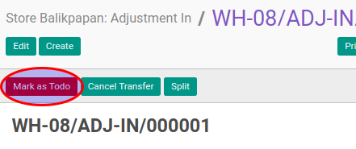

# Konfirmasi Adjustment In

## A. INPUT

* Data adjusmtnet in yang akan dikonfirmasi harus memiliki status **Draft**.

* User yang akan mengkonfirmasi harus memiliki akses untuk mengkonfirmasi adjustment in.

## B. LANGKAH KERJA

1. Buka menu **Warehouse -> Operation -> (Nama Gudang) -> Adjustment In**. Abaikan jika sudah berada
pada menu yang dimaksud.
2. Buka data adjustment in yang akan dikonfirmasi. Abaikan jika data sudah dibuka.
3. Klik tombol **Mark As Todo** pada bagian atas-kiri form.

## C. OUTPUT

* Status dari adjustment in akan berubah menjadi **Ready to Transfer**

