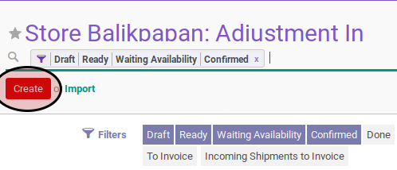

# Membuat Adjustment In

## A. INPUT

*(Tidak ada prasyarat khusus)*

## B. INSTRUKSI KERJA

1. Buka menu **Warehouse -> Operation -> (Nama Gudang) -> Adjustment In**. Abaikan jika sudah berada
2. Klik tombol **Create** pada bagian atas-kiri form.

3. Isi **Source Document**.
4. Buka tab **Products**.
5. <a name="l5">[Tambahkan](./produk-tambah.md)/[Modifikasi](./produk-modifikasi.md)/[Hapus](./produk-hapus.md)</a> produk yang akan dipindahkan. Lakukan langkah ini sampai semua produk yang akan dipindahkan sudah sesuai.
6. Isi **Internal Note**.
7. Klik tombol **Save** pada bagian atas-kiri form.

## C. OUTPUT

* Data adjustment in akan dibuat dengan status **Draft**

