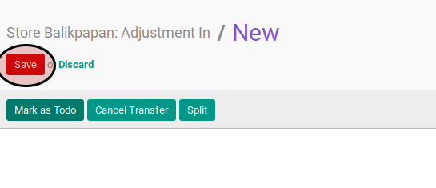

# Memodifikasi Adjustment In

## A. INPUT

* Data adjustment in yang akan dimodifikasi harus memiliki status **Draft**.

## B. INSTRUKSI KERJA

1. Buka menu **Warehouse -> Operation -> (Nama Gudang) -> Adjustment In**. Abaikan jika sudah berada
2. Buka data adjustment in yang akan dimodifikasi. Abaikan jika data sudah dibuka.
3. Klik tombol **Edit** pada bagian atas-kiri form.

4. Isi **Source Document**.
5. Buka tab **Products**.
6. <a name="l6">[Tambahkan](./produk-tambah.md)/[Modifikasi](./produk-modifikasi.md)/[Hapus](./produk-hapus.md)</a> produk yang akan dipindahkan. Lakukan langkah ini sampai semua produk yang akan dipindahkan sudah sesuai.
7. Isi **Internal Note**.
8. Klik tombol **Save** pada bagian atas-kiri form.

## C. OUTPUT

* Data adjustment berubah sesuai dengan modifikasi yang dilakukan.
