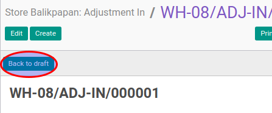

# Merestart Adjustment In

## A. INPUT

* Data adjustment in yang akan direstart harus memiliki status **Cancelled**.

* User yang akan merestart harus memiliki akses untuk merestart adjustment in.

## B. LANGKAH KERJA

1. Buka menu **Warehouse -> Operation -> (Nama Gudang) -> Adjustment In**. Abaikan jika sudah berada
pada menu yang dimaksud.
2. Buka data adjustment in yang akan direstart. Abaikan jika data sudah dibuka.
3. Klik tombol **Back To Draft** pada bagian atas-kiri form.

## C. OUTPUT

* Status dari adjustment in akan berubah menjadi **Draft**

