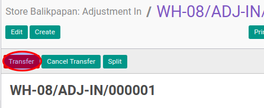

# Merealisasi Adjustment In

## A. INPUT

* Data adjustment in yang akan direalisasi harus memiliki status **Ready To Transfer**.

* User yang akan merealisasi harus memiliki akses untuk merealisasi adjustment in.

## B. LANGKAH KERJA

1. Buka menu **Warehouse -> Operation -> (Nama Gudang) -> Adjustment In**. Abaikan jika sudah berada pada menu yang dimaksud.
2. Buka data adjustment in yang akan direalisasikan. Abaikan jika data sudah dibuka.
3. Klik tombol **Transfer** pada bagian atas-kiri form.

Pop-up **Enter Transfer Detail** akan muncul

4. Isi **Actual Movement Date**.
5. <a name="l5">Untuk</a> setiap produk yang terdapat pada tabel **Product To Move** lakukan prosedur [Realisasi Produk](./transfer-produk.md).
6. Klik tombol **Apply** pada bagian bawah-kiri form

## C. OUTPUT

* Status dari adjustment in akan berubah menjadi **Transfered**

