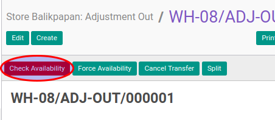

# Mengecek Ketersediaan Adjustment Out

## A. INPUT

* Data adjustment out yang akan dicek harus memiliki status **Waiting Availability**.

* User yang akan mengecek harus memiliki akses untuk mengecek adjustment out.

## B. LANGKAH KERJA

1. Buka menu **Warehouse -> Operation -> (Nama Gudang) -> Adjustment Out**. Abaikan jika sudah berada pada menu yang dimaksud.
2. Buka data adjustment out yang akan dicek. Abaikan jika data sudah dibuka.
3. Klik tombol **Check Availability** pada bagian atas-kiri form.

## C. OUTPUT

* Status dari adjustment out akan berubah menjadi **Ready To Transfer**

