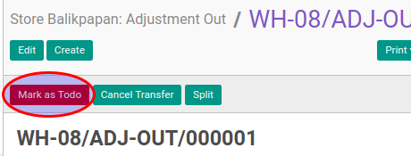

# Konfirmasi Adjustment Out

## A. INPUT

* Data adjustment out yang akan dikonfirmasi harus memiliki status **Draft**.

* User yang akan mengkonfirmasi harus memiliki akses untuk mengkonfirmasi adjustment out.

## B. LANGKAH KERJA

1. Buka menu **Warehouse -> Operation -> (Nama Gudang) -> Adjustment Out**. Abaikan jika sudah berada pada menu yang dimaksud.
2. Buka data adjustment out yang akan dikonfirmasi. Abaikan jika data sudah dibuka.
3. Klik tombol **Mark As Todo** pada bagian atas-kiri form.

## C. OUTPUT

* Status dari adjustment out akan berubah menjadi **Waiting Availability**

