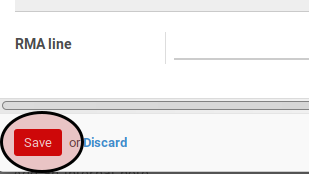

# Memodifikasi Produk Pada Adjustment Out

(Instruksi kerja ini merupakan sub instruksi dari (1) [Membuat Adjustment Out](./membuat.md), atau (2) [Memodifikasi Adjustment Out](./modifikasi.md). Instruksi kerja ini tidak bisa berdiri sendiri)*

## A. INPUT

*(Tidak ada prasyarat khusus)*

## B. INSTRUKSI KERJA

1. Buka tab **Products**.
2. Buka data produk yang akan dimodifikasi.
3. Pilih dan sesuaikan **Product** jika dibutuhkan. Harus diisi.
4. Isi dan sesuaikan **Quantity** jika dibutuhkan. Harus diisi.
5. Pilih dan sesuaikan **UoM** jika dibutuhkan. Harus diisi.
6. Isi dan sesuaikan **Quantity (UoS)** jika dibutuhkan. Tidak harus diisi.
7. Pilih dan sesuaikan **UoS** jika dibutuhkan. Tidak harus diisi.
8. Pilih dan sesuaikan **Source Location** jika dibutuhkan. Harus diisi.
9. Pilih dan sesuaikan **Analytic Account** jika dibutuhkan. Tidak harus diisi.
10. Klik tombol **Save** pada bagian bawah-kiri pop-up **Internal Moves** untuk menyimpan data.

11. Lanjutkan [langkah ke-5 Instruksi Membuat Adjustment Out](./membuat.md#l5) atau [langkah ke-6 Instruksi Memodifikasi Adjustment Out](./modifikasi.md#l6).

## C. OUTPUT

*(Tidak ada instruksi khusus)*
