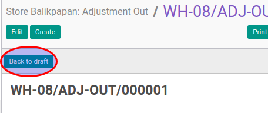

# Merestart Adjustment Out

## A. INPUT

* Data adjustment out yang akan direstart harus memiliki status **Cancelled**.
* User yang akan merestart harus memiliki akses untuk merestart adjustment out.

## B. LANGKAH KERJA

1. Buka menu **Warehouse -> Operation -> (Nama Gudang) -> Adjustment Out**. Abaikan jika sudah berada
pada menu yang dimaksud.
2. Buka data adjustment out yang akan direstart. Abaikan jika data sudah dibuka.
3. Klik tombol **Back To Draft** pada bagian atas-kiri form.

## C. OUTPUT

* Status dari adjustment out akan berubah menjadi **Draft**

