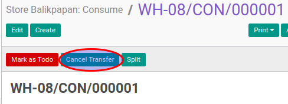

# Membatalkan Consume

## A. INPUT

* Data consume yang akan dibatalkan dapat memiliki status **Draft**, atau **Waiting Availability**, atau **Partial Available**, atau **Ready To Transfer**
* User yang akan membatalkan harus memiliki akses untuk membatalkan consume.

## B. LANGKAH KERJA

1. Buka menu **Warehouse -> Operation -> (Nama Gudang) -> Consume**. Abaikan jika sudah berada
pada menu yang dimaksud.
2. Buka data consume yang akan dibatalkan. Abaikan jika data sudah dibuka.
3. Klik tombol **Cancel Transfer** pada bagian atas-kiri form.

## C. OUTPUT

* Status dari consume akan berubah menjadi **Cancelled**

