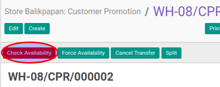

# Mengecek Ketersediaan Customer Promotion

## A. INPUT

* Data customer promotion yang akan dicek harus memiliki status **Waiting Availability**.
* User yang akan mengecek harus memiliki akses untuk mengecek customer promotion.

## B. LANGKAH KERJA

1. Buka menu **Warehouse -> Operation -> (Nama Gudang) -> Customer Promotion**. Abaikan jika sudah berada
pada menu yang dimaksud.
2. Buka data customer promotion yang akan dicek. Abaikan jika data sudah dibuka.
3. Klik tombol **Check Availability** pada bagian atas-kiri form apabila user ingin melakukan pengecekan.

4. Klik tombol **Force Availability** pada bagian atas-tengah form apabila user ingin mengabaikan proses pengecekan.

## C. OUTPUT

* Status dari customer promotion akan berubah menjadi **Ready To Transfer**

