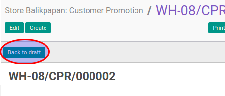

# Merestart Customer Promotion

## A. INPUT

* Data customer promotion yang akan direstart harus memiliki status **Cancelled**.
* User yang akan merestart harus memiliki akses untuk merestart customer promotion.

## B. LANGKAH KERJA

1. Buka menu **Warehouse -> Operation -> (Nama Gudang) -> Customer Promotion**. Abaikan jika sudah berada
pada menu yang dimaksud.
2. Buka data customer promotion yang akan direstart. Abaikan jika data sudah dibuka.
3. Klik tombol **Back To Draft** pada bagian atas-kiri form.

## C. OUTPUT

* Status dari customer promotion akan berubah menjadi **Draft**

