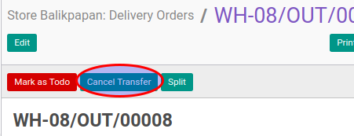

# Membatalkan Delivery Order

## A. INPUT

* Data delivery order yang akan dibatalkan dapat memiliki status **Draft**, atau **Waiting Availability**, atau **Partial Available**, atau **Ready To Transfer**
* User yang akan membatalkan harus memiliki akses untuk membatalkan delivery order.

## B. LANGKAH KERJA

1. Buka menu **Warehouse -> Operation -> (Nama Gudang) -> Delivery Order**. Abaikan jika sudah berada
pada menu yang dimaksud.
2. Buka data delivery order yang akan dibatalkan. Abaikan jika data sudah dibuka.
3. Klik tombol **Cancel Transfer** pada bagian atas-kiri form.

## C. OUTPUT

* Status dari delivery order akan berubah menjadi **Cancelled**

