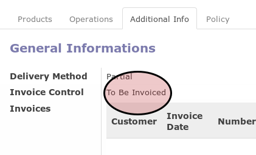

# Membuat Customer Invoice Dari Delivery Order

## A. INPUT

* Data delivery order yang akan dikonfirmasi harus memiliki status **Transfer** dan memiliki nilai **Invoice Control** sama dengan **To Be Invoiced**.

* Data delivery order yang akan dikonfirmasi harus memiliki nilai **Invoice Control** sama dengan **To Be Invoiced**.

* User yang akan membuat invoice harus memiliki akses untuk membuat invoice dari delivery order.

## B. LANGKAH KERJA

1. Buka menu **Warehouse -> Operation -> (Nama Gudang) -> Delivery Order**. Abaikan jika sudah berada
pada menu yang dimaksud.
2. Buka data delivery order yang akan dibuatkan invoicenya. Abaikan jika data sudah dibuka.
3. Klik tombol **Create Invoice** pada bagian atas-kiri form.

Pop-up **Create Draft Invoice** akan muncul

4. Pilih **Destination Journal**. Harus diisi.
5. Isi **Invoice Date**. Tidak harus diisi.
6. Klik tombol **Create** pada bagian bawah-kiri form.

## C. OUTPUT

* Nilai **Invoice Control** akan berubah menjadi **Invoiced**

* Sebuah customer invoice akan terbentuk dengan status **Draft**
