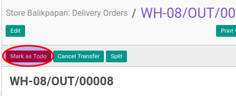

# Konfirmasi Delivery Order

## A. INPUT

* Data delivery order yang akan dikonfirmasi harus memiliki status **Draft**.
* User yang akan mengkonfirmasi harus memiliki akses untuk mengkonfirmasi delivery order.

## B. LANGKAH KERJA

1. Buka menu **Warehouse -> Operation -> (Nama Gudang) -> Delivery Order**. Abaikan jika sudah berada
pada menu yang dimaksud.
2. Buka data delivery order yang akan dikonfirmasi. Abaikan jika data sudah dibuka.
3. Klik tombol **Mark As Todo** pada bagian atas-kiri form.

## C. OUTPUT

* Status dari delivery order akan berubah menjadi **Waiting Availability**

