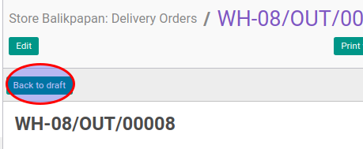

# Merestart Delivery Order

## A. INPUT

* Data delivery order yang akan direstart harus memiliki status **Cancelled**.

* User yang akan merestart harus memiliki akses untuk merestart delivery order.

## B. LANGKAH KERJA

1. Buka menu **Warehouse -> Operation -> (Nama Gudang) -> Delivery Order**. Abaikan jika sudah berada
pada menu yang dimaksud.
2. Buka data delivery order yang akan direstart. Abaikan jika data sudah dibuka.
3. Klik tombol **Back To Draft** pada bagian atas-kiri form.

## C. OUTPUT

* Status dari delivery order akan berubah menjadi **Draft**

   
