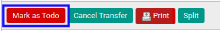
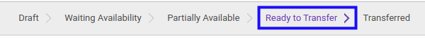

# Konfirmasi Donation In

## A. INPUT

* Data donation in yang dapat dikonfirmasi harus memiliki status **Draft**.

* User yang akan mengkonfirmasi harus memiliki akses untuk mengkonfirmasi donation in.

## B. LANGKAH KERJA

1. Buka menu **Warehouse -> Operations -> Nama Gudang -> Donation In**. Abaikan jika sudah berada pada menu yang dimaksud.
2. Buka data donation In yang akan dikonfirmasi. Abaikan jika data sudah dibuka.
3. Klik tombol **Mark as Todo** pada bagian atas-kiri form.

## C. OUTPUT

* Status dari donation in akan berubah menjadi **Ready to Transfer**.

