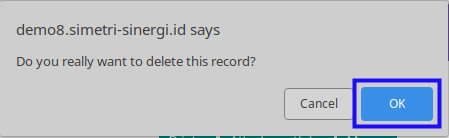

# Menghapus Donation In

## A. INPUT

* Data donation in yang dapat dihapus harus memiliki status **Draft**.

* User yang akan menghapus harus memiliki akses untuk menghapus donation in.

## B. LANGKAH KERJA

1. Buka menu **Warehouse -> Operations -> Nama Gudang -> Donation In**. Abaikan jika sudah berada pada menu yang dimaksud.
2. Buka data donation in yang akan dihapus. Abaikan jika data sudah dibuka.
3. Klik tombol **More** pada bagian atas-tengah form.

4. Klik tombol **Delete** pada *dropdown* yang muncul ketika tombol **More** diklik.

5. Klik tombol **Ok** pada *pop-up* konfirmasi penghapusan yang muncul.

## C. OUTPUT

* Data Donation In akan terhapus.
