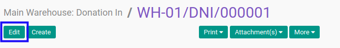
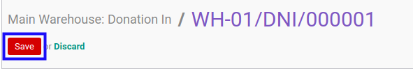

# Memodifikasi Donation In

## A. INPUT

* Data donation in yang dapat dimodifikasi harus memiliki status **Draft**.

* User yang akan memodifikasi harus memiliki akses untuk memodifikasi donation in.

## B. LANGKAH KERJA

1. Buka menu **Warehouse -> Operations -> (Nama Gudang) -> Donation In**. Abaikan jika sudah berada pada menu yang dimaksud.
2. Buka data donation in yang akan dimodifikasi. Abaikan jika data sudah dibuka.
3. Klik tombol **Edit** pada bagian atas-kiri form.

4. Pilih dan sesuaikan **[Partner](./penjelasan.md#field-partner)** jika dibutuhkan. Harus diisi.
5. Pilih dan sesuaikan **[Origin Address](./penjelasan.md#field-origin-address)** jika dibutuhkan. Harus diisi.
6. Pilih dan sesuaikan **[Delivery Address](./penjelasan.md#field-delivery-address)** jika dibutuhkan. Harus diisi.
7. Pilih dan sesuaikan **[Consignee](./penjelasan.md#field-consignee)** jika dibutuhkan. Tidak harus diisi.
8. Isi dan sesuaikan **[Scheduled Date](./penjelasan.md#field-scheduled-date)** jika dibutuhkan. Harus diisi.
9. Isi dan sesuaikan **[Source Document](./penjelasan.md#field-source-document)** jika dibutuhkan. Tidak harus diisi.
10. Beralih ke tab **[Additional Info](./penjelasan.md#tab-additional-info)**.
11. Pilih dan sesuaikan **[Delivery Method](./penjelasan.md#field-delivery-method)** jika dibutuhkan. Harus diisi.
12. Beralih ke tab **[Products](./penjelasan.md#tab-products)**.
13. <a name="l13">[Tambahkan](./produk-tambah.md)/[Modifikasi](./produk-modifikasi.md)/[Hapus](./produk-hapus.md)</a> produk yang akan dipindahkan. Lakukan langkah ini sampai semua produk yang akan dipindahkan sudah sesuai.
14. Isi dan sesuaikan **Internal Note** jika dibutuhkan. Tidak harus diisi.
15. Klik tombol **Save** pada bagian atas-kiri form.

## C. OUTPUT

* Data Donation In berubah sesuai dengan perubahan yang dilakukan.
