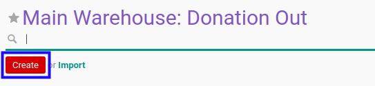
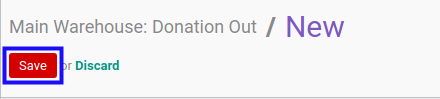

# Membuat Donation Out

## A. INPUT

*(Tidak ada instruksi khusus)*

## B. LANGKAH KERJA

1. Buka menu **Warehouse -> Operations -> Nama Gudang -> Donation Out**
2. Klik tombol **Create** pada bagian atas-kiri form.

3. Pilih **[Partner](./penjelasan.md#field-partner)**. Wajib diisi.
4. Pilih **[Origin Address](./penjelasan.md#field-origin-address)**. Tidak wajib diisi.
5. Pilih **[Delivery Address](./penjelasan.md#field-delivery-address)**. Tidak wajib diisi.
6. Pilih **[Consignee](./penjelasan.md#field-consignee)** Tidak wajib diisi.
7. Pilih **[Creation Date](./penjelasan.md#field-creation-date)**. Tidak wajib diisi.
8. Pilih **[Scheduled Date](./penjelasan.md#field-scheduled-date)**. Tidak wajib diisi.
9. Isi **[Source Document](./penjelasan.md#field-source-document)**. Tidak wajib diisi.
10. Beralih ke tab **[Products](./penjelasan.md#tab-products)**.
11. <a name="langkah-11">[Tambah](./produk-tambah.md)/[Modifikasi](./produk-modifikasi.md)/[Hapus](./produk-hapus.md)</a>  **Product**. Ulangi langkah ini sampai **Product** sesuai dengan keinginan.
12. Beralih ke tab **[Additional Info](./penjelasan.md#tab-additional-info)**.
13. Pilih **[Delivery Method](./penjelasan.md#field-delivery-method)**. Wajib diisi.
14. Pilih **[Invoice Control](./penjelasan.md#field-invoice-control)**. Wajib diisi.
15. Pilih **[Picking Type](./penjelasan.md#field-picking-type)**. Wajib diisi.
16. Pilih **[Picking Wave](./penjelasan.md#field-picking-wave)**. Tidak wajib diisi.
17. Ubah **[Company](./penjelasan.md#field-company)** jika dibutuhkan. Hanya terlihat pada implementasi multi-company. Wajib diisi.
18. Pilih **[Date of Transfer](./penjelasan.md#field-date-of-transfer)**. Tidak wajib diisi.
19. Aktifkan/ Deaktifkan **[Create Procurement Group](./penjelasan.md#field-create-procurement-group)**. Tidak wajib diisi.
20. Pilih **[Procurement Group Priority](./penjelasan.md#field-procurement-group-priority)**. Wajib diisi.
21. Pilih **[Carrier](./penjelasan.md#field-carrier)**. Tidak wajib diisi.
22. Isi **[Carrier Tracking Ref](./penjelasan.md#field-carrier-tracking-ref)**. Tidak wajib diisi.
23. Isi **[Number of Packages](./penjelasan.md#number-of-packages)**. Tidak wajib diisi.
24. <a name="langkah-24">Klik</a> tombol **Save** pada bagian atas-kiri form.

## C. OUTPUT

*(Tidak ada instruksi khusus)*
