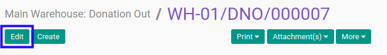
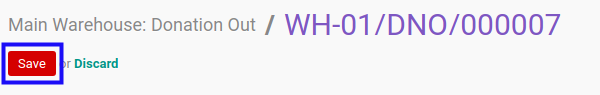

# Memodifikasi Donation Out

## A. INPUT

* Data donation out yang dapat dimodifikasi harus memiliki status **Draft**.

* User yang akan memodifikasi harus memiliki akses untuk memodifikasi donation out.

## B. LANGKAH KERJA

1. Buka menu **Warehouse -> Operations -> Nama Gudang -> Donation Out**. Abaikan jika sudah berada pada menu yang dimaksud.
2. Buka data donation out yang akan dimodifikasi. Abaikan jika data sudah dibuka.
3. Klik tombol **Edit** pada bagian atas-kiri form.

4. Pilih dan sesuaikan **[Partner](./penjelasan.md#field-partner)** jika dibutuhkan. Wajib diisi.
5. Pilih dan sesuaikan **[Origin Address](./penjelasan.md#field-origin-address)** jika dibutuhkan. Tidak wajib diisi.
6. Pilih dan sesuaikan **[Delivery Address](./penjelasan.md#field-delivery-address)** jika dibutuhkan. Tidak wajib diisi.
7. Pilih dan sesuaikan **[Consignee](./penjelasan.md#field-consignee)** jika dibutuhkan. Tidak wajib diisi.
8. Pilih dan sesuaikan **[Creation Date](./penjelasan.md#field-creation-date)** jika dibutuhkan. Tidak wajib diisi.
9. Pilih dan sesuaikan **[Scheduled Date](./penjelasan.md#field-scheduled-date)** jika dibutuhkan. Tidak wajib diisi.
10. Isi dan sesuaikan **[Source Document](./penjelasan.md#field-source-document)** jika dibutuhkan. Tidak wajib diisi.
11. Beralih ke tab **[Products](./penjelasan.md#tab-products)**.
12. <a name="langkah-12">[Tambah](./produk-tambah.md)/[Modifikasi](./produk-modifikasi.md)/[Hapus](./produk-hapus.md)</a>  **Product**. Ulangi langkah ini sampai **Product** sesuai dengan keinginan.
13. Beralih ke tab **[Additional Info](./penjelasan.md#tab-additional-info)**.
14. Pilih dan sesuaikan **[Delivery Method](./penjelasan.md#field-delivery-method)** jika dibutuhkan. Wajib diisi.
15. Pilih dan sesuaikan **[Invoice Control](./penjelasan.md#field-invoice-control)** jika dibutuhkan. Wajib diisi.
16. Pilih dan sesuaikan **[Picking Type](./penjelasan.md#field-picking-type)** jika dibutuhkan. Wajib diisi.
17. Pilih dan sesuaikan **[Picking Wave](./penjelasan.md#field-picking-wave)** jika dibutuhkan. Tidak wajib diisi.
18. Ubah **[Company](./penjelasan.md#field-company)** jika dibutuhkan. Hanya terlihat pada implementasi multi-company. Wajib diisi.
19. Pilih dan sesuaikan **[Date of Transfer](./penjelasan.md#field-date-of-transfer)** jika dibutuhkan. Tidak wajib diisi.
20. Aktifkan/ Deaktifkan **[Create Procurement Group](./penjelasan.md#field-create-procurement-group)** jika dibutuhkan. Tidak wajib diisi.
21. Pilih dan sesuaikan **[Procurement Group Priority](./penjelasan.md#field-procurement-group-priority)** jika dibutuhkan. Wajib diisi.
22. Pilih dan sesuaikan **[Carrier](./penjelasan.md#field-carrier)** jika dibutuhkan. Tidak wajib diisi.
23. Isi dan sesuaikan **[Carrier Tracking Ref](./penjelasan.md#field-carrier-tracking-ref)** jika dibutuhkan. Tidak wajib diisi.
24. Isi dan sesuaikan **[Number of Packages](./penjelasan.md#number-of-packages)** jika dibutuhkan. Tidak wajib diisi.
25. <a name="langkah-25">Klik</a> tombol **Save** pada bagian atas-kiri form.

## C. OUTPUT

* Data Donation Out akan berubah sesuai dengan perubahan yang dilakukan.
