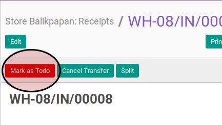

# Konfirmasi Goods Receipt

## A. INPUT

* Data goods receipt yang akan direstart harus memiliki status **Draft**.
* User yang akan mengkonfirmasi harus memiliki akses untuk mengkonfirmasi goods receipt.

## B. LANGKAH KERJA

1. Buka menu **Warehouse -> Operation -> (Nama Gudang) -> Receipts**. Abaikan jika sudah berada
pada menu yang dimaksud.
2. Buka data goods receipt yang akan direstart. Abaikan jika data sudah dibuka.
3. Klik tombol **Mark As Todo** pada bagian atas-kiri form.

## C. OUTPUT

* Status dari goods receipt akan berubah menjadi **Ready To Transfer**

