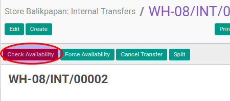

# Mengecek Ketersediaan Internal Transfer

## A. INPUT

* Data internal transfer yang akan dicek harus memiliki status **Waiting Availability**.

* User yang akan mengecek harus memiliki akses untuk mengecek internal transfer.

## B. LANGKAH KERJA

1. Buka menu **Warehouse -> Operation -> (Nama Gudang) -> Internal Transfer**. Abaikan jika sudah berada pada menu yang dimaksud.
2. Buka data internal transfer yang akan dicek. Abaikan jika data sudah dibuka.
3. Klik tombol **Check Availability** pada bagian atas-kiri form.

## C. OUTPUT

* Status dari Internal Transfer akan berubah menjadi **Ready To Transfer** apabila semua produk tersedia.

* Status dari Internal Transfer akan berubah menjadi **Partially Available** apabila hanya sebagian produk yang tersedia.

* Status dari Internal Transfer tetap **Waiting Availability** apabila produk tidak tersedia.

