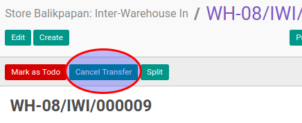

# Membatalkan Inter-Warehouse In

## A. INPUT

* Data inter-warehouse in yang akan dibatalkan dapat memiliki status **Draft**, atau **Waiting Availability**, atau **Partial Available**, atau **Ready To Transfer**
* User yang akan membatalkan harus memiliki akses untuk membatalkan inter-warehouse in.

## B. LANGKAH KERJA

1. Buka menu **Warehouse -> Operation -> (Nama Gudang) -> Inter-Warehouse In**. Abaikan jika sudah berada
pada menu yang dimaksud.
2. Buka data inter-warehouse in yang akan dibatalkan. Abaikan jika data sudah dibuka.
3. Klik tombol **Cancel Transfer** pada bagian atas-kiri form.

## C. OUTPUT

* Status dari inter-warehouse in akan berubah menjadi **Cancelled**

