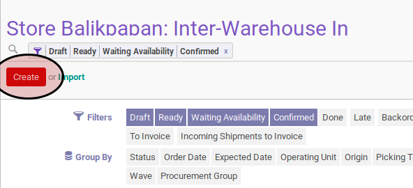
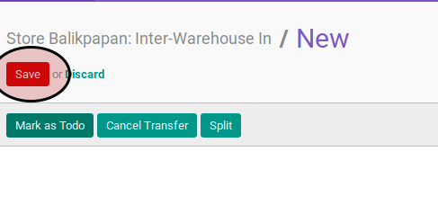

# Membuat Inter-Warehouse In

## A. INPUT

*(Tidak ada prasyarat khusus)*

## B. INSTRUKSI KERJA

1. Buka menu **Warehouse -> Operation -> (Nama Gudang) -> Inter-Warehouse In**. Abaikan jika sudah berada
2. Klik tombol **Create** pada bagian atas-kiri form.

3. Pilih **Origin Address**.
4. Pilih **Destination Address**.
5. Pilih **Consignee**.
6. Isi **Schedule Date**.
7. Isi **Source Document**.
8. Buka tab **Additional Information**.
9. Pilih **Delivery Method**.
10. Buka tab **Products**.
11. <a name="l11">[Tambahkan](./produk-tambah.md)/[Modifikasi](./produk-modifikasi.md)/[Hapus](./produk-hapus.md)</a> produk yang akan dipindahkan. Lakukan langkah ini sampai semua produk yang akan dipindahkan sudah sesuai.
12. Isi **Internal Note**
13. Klik tombol **Save** pada bagian atas-kiri form.

## C. OUTPUT

* Data inter-warehouse in akan dibuat dengan status **Draft**

