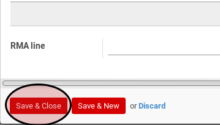

# Menambahkan Produk Pada Inter-Warehouse In

*(Instruksi kerja ini merupakan sub instruksi dari Membuat Inter-Warehouse In dan tidak bisa berdiri sendiri)*

## A. INPUT

*(Tidak ada prasyarat khusus)*

## B. INSTRUKSI KERJA

1. Buka tab **Products**.
2. Klik tabel **Add an Item** pada bagian bawah tabel **Products**. Pop-up **Internal Moves** akan muncul

3. Pilih **Product**. Harus diisi.
4. Isi **Quantity**. Harus diisi.
5. Pilih dan sesuaikan **UoM** jika dibutuhkan. Harus diisi.
6. Isi **Quantity (UoS)**. Tidak harus diisi.
7. Pilih dan sesuaikan **UoS** jika dibutuhkan. Tidak harus diisi.
8. Pilih **Source Location**. Harus diisi.
9. Klik tombol **Save & Close** pada bagian bawah-kiri pop-up **Internal Moves** untuk menyimpan data. Klik tombol **Save & New** pada bagian bawah-kiri pop-up **Internal Moves** untuk menyimpan data dan menambahkan data baru.

10. Ulangi langkah ke-3 jika pada langkah ke-9 tombol **Save & New** yang dipilih.
11. Lanjutkan [langkah ke-11 Instruksi Membuat Inter-Warehouse In](./membuat.md#l11).

## C. OUTPUT

*(Tidak ada instruksi khusus)*
