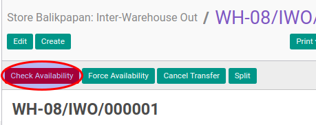
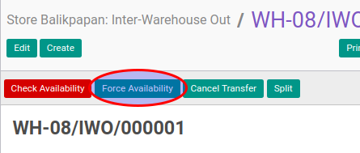
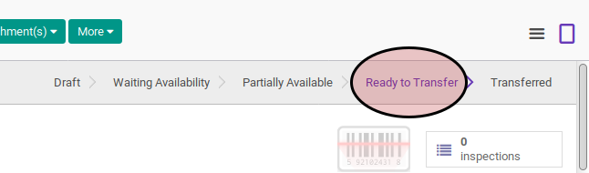

# Mengecek Ketersediaan Interwarehouse Out

## A. INPUT

* Data inter-warehouse out yang akan dicek harus memiliki status **Waiting Availability**.
* User yang akan mengecek harus memiliki akses untuk mengecek inter-warehouse out.

## B. LANGKAH KERJA

1. Buka menu **Warehouse -> Operation -> (Nama Gudang) -> Inter-Warehouse Out**. Abaikan jika sudah berada
pada menu yang dimaksud.
2. Buka data inter-warehouse out yang akan dicek. Abaikan jika data sudah dibuka.
3. Klik tombol **Check Availability** pada bagian atas-kiri form apabila user ingin melakukan pengecekan.

4. Klik tombol **Force Availability** pada bagian atas-tengah form apabila user ingin mengabaikan proses pengecekan.

## C. OUTPUT

* Status dari inter-warehouse out akan berubah menjadi **Ready To Transfer**

