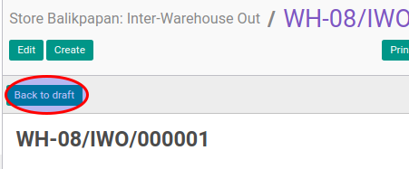

# Merestart Interwarehouse Out

## A. INPUT

* Data inter-warehouse out yang akan direstart harus memiliki status **Cancelled**.

* User yang akan merestart harus memiliki akses untuk merestart inter-warehouse out.

## B. LANGKAH KERJA

1. Buka menu **Warehouse -> Operation -> (Nama Gudang) -> Inter-Warehouse Out**. Abaikan jika sudah berada pada menu yang dimaksud.
2. Buka data inter-warehouse out yang akan direstart. Abaikan jika data sudah dibuka.
3. Klik tombol **Back To Draft** pada bagian atas-kiri form.

## C. OUTPUT

* Status dari inter-warehouse out akan berubah menjadi **Draft**

