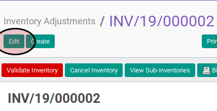

# Mengisi Inventory Detail

## A. INPUT

* Data inventory adjustment yang akan dilengkapi detailnya harus memiliki status **In-Progress**.

## B. LANGKAH KERJA

1. Buka menu **Warehouse -> Inventory Control -> Inventory Adjustment**. Abaikan jika sudah berada pada menu yang dimaksud.
2. Buka data inventory adjustment yang akan dilengkapi detailnya. Abaikan jika data sudah dibuka.
3. Klik tombol **Edit** pada bagian atas-kiri form.

4. Buka tab **Inventory Details**.
5. Untuk setiap data yang terdapat pada tabel **Inventory Detail** lengkapi data sesuai [Petunjuk Pengisian Inventory Adjustment Details](./petunjuk-pengisian-detail.md).
6. Klik tombol **Save** pada bagian atas-kiri form

## C. OUTPUT

* Isian **Cost Price** dan **Real Quantity** pada tiap inventory detail sudah sesuai dengan keadaan aktual.
