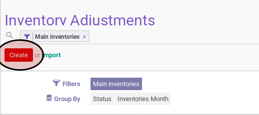
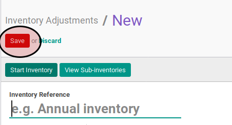
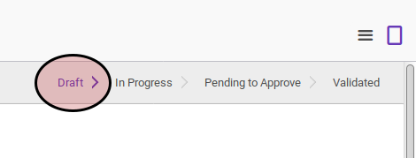

# Membuat Inventory Adjustment

## A. INPUT

## B. LANGKAH KERJA

1. Buka menu **Warehouse -> Inventory Control -> Inventory Adjustment**. Abaikan jika sudah berada pada menu yang dimaksud.
2. Klik tombol **Create** pada bagian atas-kiri form.

3. Lengkapi data inventory adjustment sesuai dengan [Petunjuk Pengisian Inventory Adjustment](./petunjuk-pengisian.md).
4. Klik tombol **Save** pada bagian atas-kiri form.

## C. OUTPUT

* Data inventory adjustment akan terbuat dengan status **Draft**.

