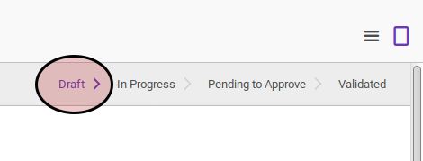
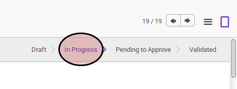

# Memulai Inventory Adjustment

## A. INPUT

* Data inventory adjustment yang akan dimulai harus memiliki status **Draft**.

* User yang akan memulai harus memiliki akses untuk memulai inventory adjustment.

## B. LANGKAH KERJA

1. Buka menu **Warehouse -> Inventory Control -> Inventory Adjustment**. Abaikan jika sudah berada pada menu yang dimaksud.
2. Buka data inventory adjustment yang akan dimulai. Abaikan jika data sudah dibuka.
3. Klik tombol **Start Inventory** pada bagian atas-kiri form.

Pop-up konfirmasi akan muncul

4. Klik tombol **Ok** pada pop-up konfirmasi

## C. OUTPUT

* Status inventory adjustment akan berubah menjadi **In Progress**.

