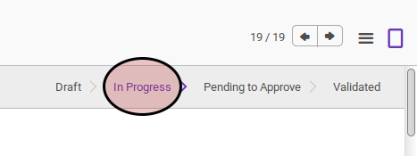
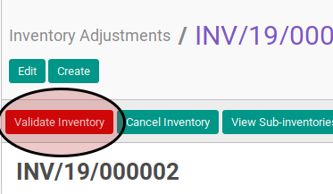
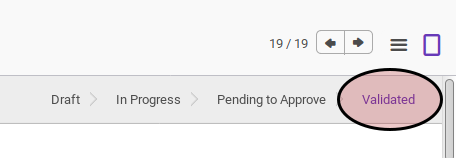
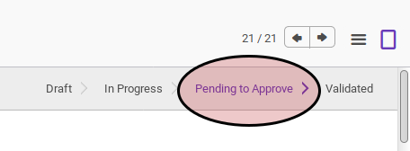

# Memvalidasi Inventory Adjustment

## A. INPUT

* Data inventory adjustment yang akan divalidasi harus memiliki status **In Progress**.

* User yang akan memulai harus memvalidasi akses untuk memvalidasi inventory adjustment.

## B. LANGKAH KERJA

1. Buka menu **Warehouse -> Inventory Control -> Inventory Adjustment**. Abaikan jika sudah berada pada menu yang dimaksud.
2. Buka data inventory adjustment yang akan dimulai. Abaikan jika data sudah dibuka.
3. Klik tombol **Validate Inventory** pada bagian atas-kiri form.

## C. OUTPUT

* Status inventory adjustment akan berubah menjadi **Validated** apabila tidak ada inventory detail dengan **Discrepancy** yang melebihi batas toleransi.

* Status inventory adjustment akan berubah menjadi **Pending To Approve** apabila ada inventory detail dengan **Discrepancy** yang melebihi batas toleransi

