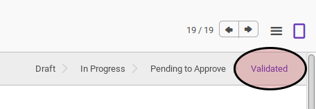

# Menyetujui Selisih Inventory Adjustment

## A. INPUT

* Data inventory adjustment yang akan disetujui harus memiliki status **Pending To Approve**.

* User yang akan memulai harus menyetujui akses untuk menyetujui inventory adjustment.

## B. LANGKAH KERJA

1. Buka menu **Warehouse -> Inventory Control -> Inventory Adjustment**. Abaikan jika sudah berada pada menu yang dimaksud.
2. Buka data inventory adjustment yang akan dimulai. Abaikan jika data sudah dibuka.
3. Klik tombol **Force Validation** pada bagian atas-kiri form.

## C. OUTPUT

* Status inventory adjustment akan berubah menjadi **Validated**.

