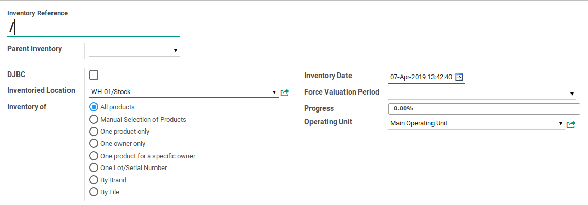
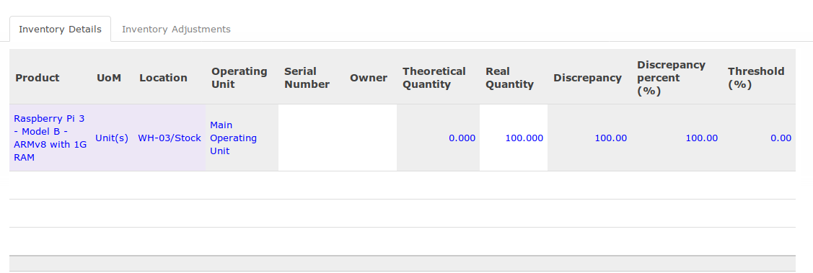
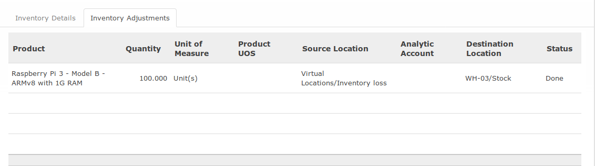

# Penjelasan

## <a name="header">A. HEADER</a>

### <a name="field-inventory-reference">Inventory Reference</a>

Nomor dokumen stok opname

### <a name="field-parent-inventory">Parent Inventory</a>

### <a name="field-djbc">DJBC</a>

#TODO

### <a name="field-location">Inventoried Location</a>

Lokasi dimana stok opname akan dilakukan

### <a name="field-inventory-of">Inventory Of</a>

* **All Products**.
* **Manual Selection of Products**.
* **One product only**.
* **One owner only**.
* **One product for specific owner**.
* **One Lot/Serial Number**.
* **By Brand**.
* **By File**.

### <a name="field-inventory-date">Inventory Date</a>

Tanggal stok opname

### <a name="field-force-valuation-period">Force Valuation Period</a>

#TODO

### <a name="field-progress">Progress</a>

#TODO

### <a name="field-operating-unit">Operating Unit</a>

Operating unit pemilik stok opname

## <a name="tab-inventory-detail">B. TAB INVENTORY DETAIL</a>

### <a name="field-product">Product</a>

Produk yang distok opname

### <a name="field-uom">UoM</a>

Satuan produk

### <a name="field-location">Location</a>

Lokasi yang di stok opname

### <a name="field-operating-unit">Operating Unit</a>

### <a name="field-serial-number">Serial Number</a>

### <a name="field-owner">Owner</a>

### <a name="field-theoritical-quantity">Theoritical Quantity</a>

Jumlah stok di sistem

### <a name="field-real-quantity">Real Quantity</a>

Jumlah stok aktual (sesuai dengan perhitungan manual)

### <a name="field-discrepancy">Discrepancy</a>

Perbedaan antara jumlah stok di sistem dan jumlah aktual. Dihitung dari **Real Quantity** - **Theoritical Quantity**.

### <a name="field-discrepancy-percent">

Persentase perbedaan antara jumlah stok di sistem dan jumlah aktual

### <a name="field-threshold">Threshold</a>

Ambang batas perbedaan yang diizinkan.

## <a name="tab-inventory-adjustment">C. TAB INVENTORY ADJUSTMENT</a>

