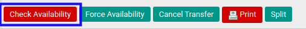
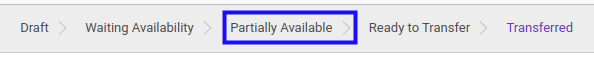

# Mengecek Ketersediaan Lease Customer In

## A. INPUT

* Data lease customer in yang akan dicek harus memiliki status **Waiting Availability**.

* User yang akan mengecek harus memiliki akses untuk mengecek ketersediaan lease customer in.

## B. LANGKAH KERJA

1. Buka menu **Warehouse -> Operations -> (Nama Gudang) -> Lease Customer In**. Abaikan jika sudah berada pada menu yang dimaksud.
2. Buka data Lease Customer In yang akan dicek. Abaikan jika data sudah dibuka.
3. Klik tombol **Check Availability** pada bagian atas-kiri form.

## C. OUTPUT

* Status dari lease customer in akan berubah menjadi **Ready To Transfer** apabila semua produk tersedia.

* Status dari lease customer in akan berubah menjadi **Partially Available** apabila hanya sebagian produk yang tersedia.

* Status dari lease customer in tetap **Waiting Availability** apabila produk tidak tersedia.

