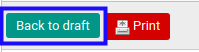

# Merestart Lease Customer In

## A. INPUT

* Data lease customer in yang akan direstart harus memiliki status **Cancelled**.

* User yang akan merestart harus memiliki akses untuk merestart lease customer in.

## B. LANGKAH KERJA

1. Buka menu **Warehouse -> Operations -> (Nama Gudang) -> Lease Customer In**. Abaikan jika sudah berada pada menu yang dimaksud.
2. Buka data lease customer in yang akan direstart. Abaikan jika data sudah dibuka.
3. Klik tombol **Back To Draft** pada bagian atas-kiri form.

## C. OUTPUT

* Status dari lease customer in akan berubah menjadi **Draft**

