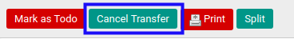

# Membatalkan Lease Customer Out

## A. INPUT

* Data lease customer out yang akan dibatalkan dapat memiliki status **Draft**, atau **Waiting Availability**, atau **Partially Available**, atau **Ready To Transfer**.
* User yang akan membatalkan harus memiliki akses untuk membatalkan lease customer out.

## B. LANGKAH KERJA

1. Buka menu **Warehouse -> Operations -> (Nama Gudang) -> Lease Customer Out**. Abaikan jika sudah berada pada menu yang dimaksud.
2. Buka data lease customer out yang akan dibatalkan. Abaikan jika data sudah dibuka.
3. Klik tombol **Cancel Transfer** pada bagian atas-kiri form.

## C. OUTPUT

* Status dari lease customer out akan berubah menjadi **Cancelled**.

