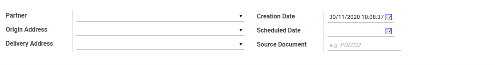
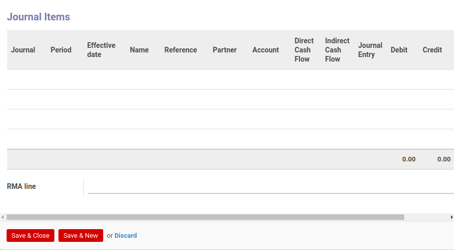

# Penjelasan Lease Customer Out

Informasi pada *Lease Customer Out* dibagi menjadi beberapa area, diantaranya:

* [Header](#bagian-header)
* [Tab Products](#tab-products)
* [Tab Additional Info](#tab-additional-info)
* [Tab Policy](#tab-policy)

### <a name="bagian-header">HEADER</a>

#### <a name="field-name">Partner</a>

Nama partner penyedia barang.

#### <a name="field-origin-address">Origin Address</a>

Alamat asal pengiriman.

#### <a name="field-delivery-address">Delivery Address</a>

Alamat tujuan pengiriman.

#### <a name="field-creation-date">Creation Date</a>

Tanggal transaksi.

#### <a name="field-scheduled-date">Scheduled Date</a>

Tanggal jadwal pengiriman.

#### <a name="field-source-document">Source Document</a>

Sumber referensi dokumen.

### <a name="tab-products">TAB PRODUCTS</a>

Tampilan tree:

Tampilan form:

#### <a name="field-product">Product</a>

Nama barang.

#### <a name="field-description">Description</a>

Keterangan tambahan.

#### <a name="field-date">Date</a>

Tanggal transaksi.

#### <a name="field-expected-date">Expected Date</a>

to-do.

#### <a name="field-weight">Weight</a>

Berat kotor barang.

#### <a name="field-net-weight">Net Weight</a>

Berat bersih barang.

#### <a name="field-invoice-control">Invoice Control</a>

Kontrol penagihan atas barang.

#### <a name="field-supply-method">Supply Method</a>

Metode suplai barang.

#### <a name="field-quantity">Quantity</a>

Jumlah barang.

#### <a name="field-source-location">Source Location</a>

Lokasi sumber asal barang.

#### <a name="field-destination-location">Destination Location</a>

Lokasi tujuan pengiriman barang.

#### <a name="field-destination-move">Destination Move</a>

Lokasi tujuan perpindahan.

#### <a name="field-original-move">Original Move</a>

Lokasi awal perpindahan.

#### <a name="field-move-split-from">Move Split From</a>

Asal lot pemisahan barang.

#### <a name="field-back-order-of">Back Order Of</a>

Referensi back order.

#### <a name="field-origin-return-move">Origin Return Move</a>

Asal pergerakan pengembalian.

#### <a name="field-all-return-moves">All Return Moves</a>

Catatan seluruh perpindahan pengembalian.

#### <a name="field-procurement">Procurement</a>

Nama pembelian.

#### <a name="field-procurement-group">Procurement Group</a>

Kelompok pembelian.

#### <a name="field-procurement-rule">Procurement Rule</a>

Nama aturan pembelian.

#### <a name="field-push-rule">Push Rule</a>

Memaksa aturan yang akan diterapkan.

#### <a name="field-propagate">Propagate Cancel and Split</a>

Status aktif pembatalan dan pemisahan.

#### <a name="field-destination-route">Destination Route</a>

to-do.

#### <a name="field-rma-lines">RMA Lines</a>

to-do.

### <a name="tab-additional-info">TAB ADDITIONAL INFO</a>

#### <a name="field-delivery-method">Delivery Method</a>

Metode pengiriman barang.

#### <a name="field-invoice-control">Invoice Control</a>

Kontrol penagihan atas barang.

#### <a name="field-picking-type">Picking Type</a>

Tipe transaksi barang.

#### <a name="field-picking-wave">Picking Wave</a>

to-do.

#### <a name="field-company">Company</a>

Nama perusahaan.

#### <a name="field-date-of-transfer">Date of Transfer</a>

Tanggal pengiriman barang.

#### <a name="field-create-procurement-group">Create Procurement Group</a>

Membuat pengelompokan pembelian.

#### <a name="field-procurement-group-priority">Procurement Group Priority</a>

Prioritas terhadap kelompok pembelian.

#### <a name="field-carrier">Carrier</a>

Nama pengirim barang.

#### <a name="field-carrier-tracking-ref">Carrier Tracking Ref</a>

Referensi pelacakan pengiriman barang.

#### <a name="field-carrier-weight">Weight</a>

Berat kotor barang.

#### <a name="field-carrier-net-weight">Net Weight</a>

Berat bersih barang.

#### <a name="field-number-of-package">Number of Package</a>

Jumlah paket barang.

### <a name="tab-policy">TAB POLICY</a>

#### <a name="field-can-confirm">Can Confirm</a>

Kebijakan untuk dapat melakukan konfirmasi.

#### <a name="field-can-force-availability">Can Force Availability</a>

Kebijakan untuk dapat memaksa ketersediaan.

#### <a name="field-can-transfer">Can Transfer</a>

Kebijakan untuk dapat merealisasikan.

#### <a name="field-can-return">Can Return</a>

Kebijakan untuk dapat mengembalikan.

#### <a name="field-can-cancel">Can Cancel</a>

Kebijakan untuk dapat membatalkan.

#### <a name="field-can-unreserve">Can Unreserve</a>

Kebijakan untuk tidak memberikan cadangan.

#### <a name="field-can-back-to-draft">Can Back to Draft</a>

Kebijakan untuk dapat mengembalikan ke status Draft.

#### <a name="field-can-invoice">Can Invoice</a>

Kebijakan untuk dapat melakukan penagihan.

#### <a name="field-can-split">Can Split</a>

Kebijakan untuk dapat membagi pengiriman.
