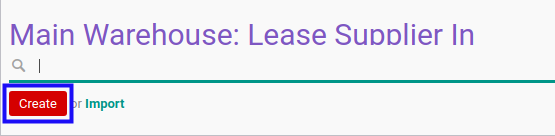
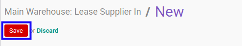

# Membuat Lease Supplier In

## A. INPUT

*(Tidak ada instruksi khusus)*

## B. LANGKAH KERJA

1. Buka menu **Warehouse -> Operations -> (Nama Gudang) -> Lease Supplier In**. Abaikan jika sudah berada pada menu yang dimaksud.
2. Klik tombol **Create** pada bagian atas-kiri form.

3. Pilih **[Partner](./penjelasan.md#field-partner)**. Harus diisi.
4. Pilih **[Origin Address](./penjelasan.md#field-origin-address)**. Harus diisi.
5. Pilih **[Delivery Address](./penjelasan.md#field-delivery-address)**. Harus diisi.
6. Pilih **[Consignee](./penjelasan.md#field-consignee)**. Tidak harus diisi.
7. Isi **[Scheduled Date](./penjelasan.md#field-scheduled-date)**. Harus diisi.
8. Isi **[Source Document](./penjelasan.md#field-source-document)**. Tidak harus diisi.
9. Beralih ke tab **[Additional Info](./penjelasan.md#tab-additional-info)**.
10. Pilih **[Delivery Method](./penjelasan.md#field-delivery-method)**. Harus diisi.
11. Beralih ke tab **[Products](./penjelasan.md#tab-products)**.
12. <a name="l12">[Tambahkan](./produk-tambah.md)/[Modifikasi](./produk-modifikasi.md)/[Hapus](./produk-hapus.md)</a> produk yang akan dipindahkan. Lakukan langkah ini sampai semua produk yang akan dipindahkan sudah sesuai.
13. Isi **Internal Note**. Tidak harus diisi.
14. Klik tombol **Save** pada bagian atas-kiri form.

## C. OUTPUT

* Data lease supplier in akan dibuat dengan status **Draft**

