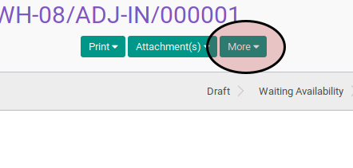

# Menghapus Missing

## A. INPUT

* Data missing yang akan dihapus harus memiliki status **Draft**

## B. INSTRUKSI KERJA

1. Buka menu **Warehouse -> Operation -> (Nama Gudang) -> Missing**. Abaikan jika sudah berada
2. Buka data missing yang akan dihapus. Abaikan jika data sudah dibuka.
3. Klik tombol **More** pada bagian atas-tengah form.

4. Klik tombol **Delete** pada drop-down yang muncul pada tombol **More**.

5. Klik tombol **Ok** pada dialog konfirmasi penghapusan.

## C. OUTPUT

* Data missing akan terhapus.
