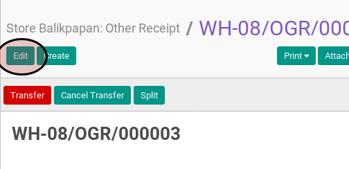

# Memodifikasi Other Delivery

## A. INPUT

* Data other delivery yang akan dimodifikasi harus memiliki status **Draft**

## B. INSTRUKSI KERJA

1. Buka menu **Warehouse -> Operation -> (Nama Gudang) -> Other Delivery**. Abaikan jika sudah berada.
2. Buka data other delivery yang akan dimodifikasi. Abaikan jika data sudah dibuka.
2. Klik tombol **Edit** pada bagian atas-kiri form.

4. Pilih dan sesuaikan **Partner** jika dibutuhkan. Harus diisi.
5. Pilih dan sesuaikan **Origin Address** jika dibutuhkan. Harus diisi.
6. Pilih dan sesuaikan **Destination Address** jika dibutuhkan. Harus diisi.
7. Pilih dan sesuaikan **Consignee** jika dibutuhkan. Tidak harus diisi.
8. Isi dan sesuaikan **Schedule Date** jika dibutuhkan. Harus diisi.
9. Isi dan sesuaikan **Source Document** jika dibutuhkan. Tidak harus diisi.
10. Buka tab **Additional Information**.
11. Pilih dan sesuaikan **Delivery Method** jika dibutuhkan. Harus diisi.
12. Buka tab **Products**.
13. <a name="l13">[Tambahkan](./produk-tambah.md)/[Modifikasi](./produk-modifikasi.md)/[Hapus](./produk-hapus.md)</a> produk yang akan dipindahkan. Lakukan langkah ini sampai semua produk yang akan dipindahkan sudah sesuai.
14. Isi dan sesuaikan **Internal Note** jika dibutuhkan. Tidak harus diisi.
15. Klik tombol **Save** pada bagian atas-kiri form.

## C. OUTPUT

* Data other delivery berubah sesuai dengan perubahan yang dilakukan.
