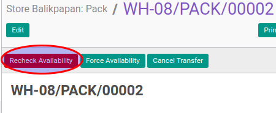

# Mengecek Ketersediaan Pack

## A. INPUT

* Data pack yang akan dicek harus memiliki status **Waiting Availability**.

* User yang akan mengecek harus memiliki akses untuk mengecek pack.

## B. LANGKAH KERJA

1. Buka menu **Warehouse -> Operation -> (Nama Gudang) -> Pack**. Abaikan jika sudah berada
pada menu yang dimaksud.
2. Buka data pack yang akan dicek. Abaikan jika data sudah dibuka.
3. Klik tombol **Check Availability** pada bagian atas-kiri form.

## C. OUTPUT

* Status dari pack akan berubah menjadi **Ready To Transfer**

