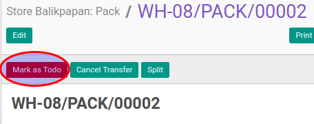

# Konfirmasi Pack

## A. INPUT

* Data pack yang akan dikonfirmasi harus memiliki status **Draft**.
* User yang akan mengkonfirmasi harus memiliki akses untuk mengkonfirmasi pack.

## B. LANGKAH KERJA

1. Buka menu **Warehouse -> Operation -> (Nama Gudang) -> Pack**. Abaikan jika sudah berada
pada menu yang dimaksud.
2. Buka data pack yang akan dikonfirmasi. Abaikan jika data sudah dibuka.
3. Klik tombol **Mark As Todo** pada bagian atas-kiri form.

## C. OUTPUT

* Status dari pack akan berubah menjadi **Waiting Availability**

