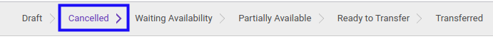

# Membatalkan Rental Customer In

## A. INPUT

* Data rental customer in yang akan dibatalkan dapat memiliki status **Draft**, atau **Ready To Transfer**.
* User yang akan membatalkan harus memiliki akses untuk membatalkan rental customer in.

## B. LANGKAH KERJA

1. Buka menu **Warehouse -> Operations -> (Nama Gudang) -> Rental Customer In**. Abaikan jika sudah berada pada menu yang dimaksud.
2. Buka data rental customer in yang akan dibatalkan. Abaikan jika data sudah dibuka.
3. Klik tombol **Cancel Transfer** pada bagian atas-kiri form.

## C. OUTPUT

* Status dari rental customer in akan berubah menjadi **Cancelled**.

