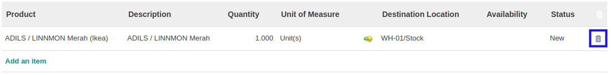

# Menghapus Produk Pada Rental Customer In

*(Instruksi kerja ini merupakan sub instruksi dari (1) [Membuat Rental Customer In](./membuat.md), atau (2) [Memodifikasi Rental Customer In](./modifikasi.md). Instruksi kerja ini tidak bisa berdiri sendiri)*

## A. INPUT

*(Tidak ada prasyarat khusus)*

## B. INSTRUKSI KERJA

1. Buka tab **[Products](./penjelasan.md#tab-products)**.
2. Klik icon keranjang sampah pada bagian kanan data **Product** yang akan dihapus.

3. Lanjutkan [langkah ke-11 Instruksi Membuat Rental Customer In](./membuat.md#l11) atau [langkah ke-12 Instruksi Memodifikasi Rental Customer In](./modifikasi.md#l12).

## C. OUTPUT

*(Tidak ada instruksi khusus)*
