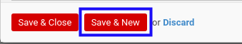

# Menambahkan Produk Pada Rental Customer In

*(Instruksi kerja ini merupakan sub instruksi dari (1) [Membuat Rental Customer In](./membuat.md), atau (2) [Memodifikasi Rental Customer In](./modifikasi.md). Instruksi kerja ini tidak bisa berdiri sendiri)*

## A. INPUT

*(Tidak ada prasyarat khusus)*

## B. INSTRUKSI KERJA

1. Buka tab **[Products](./penjelasan.md#tab-products)**.
2. Klik tabel **Add an Item** pada bagian bawah tabel **Products**. Pop-up **Internal Moves** akan muncul.

3. Pilih **[Product](./penjelasan.md#field-product)**. Harus diisi.
4. Isi **[Quantity](./penjelasan.md#field-quantity)**. Harus diisi.
5. Pilih dan sesuaikan **UoM** jika dibutuhkan. Harus diisi.
6. Isi **Quantity (UoS)**. Tidak harus diisi.
7. Pilih dan sesuaikan **UoS** jika dibutuhkan. Tidak harus diisi.
8. Klik tombol **Save & Close** pada bagian bawah-kiri pop-up **Internal Moves** untuk menyimpan data. Klik tombol **Save & New** pada bagian bawah-kiri pop-up **Internal Moves** untuk menyimpan data dan menambahkan data baru.

9. Ulangi langkah ke-3 jika pada langkah ke-8 tombol **Save & New** yang dipilih.
10. Lanjutkan [langkah ke-11 Instruksi Membuat Rental Customer In](./membuat.md#l11) atau [langkah ke-12 Instruksi Memodifikasi Rental Customer In](./modifikasi.md#l12).

## C. OUTPUT

*(Tidak ada instruksi khusus)*
