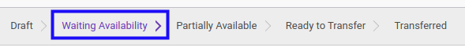

# Memaksa Ketersediaan Rental Supplier Out

## A. INPUT

* Data rental supplier out yang akan dipaksa ketersediaan-nya harus memiliki status **Waiting Availability** atau **Partially Available**

* User yang akan memaksa ketersediaan harus memiliki akses untuk memaksa ketersediaan rental supplier out.

## B. LANGKAH KERJA

1. Buka menu **Warehouse -> Operations -> (Nama Gudang) -> Rental Supplier Out**. Abaikan jika sudah berada pada menu yang dimaksud.
2. Buka data rental supplier out yang akan dipaksa ketersediaan-nya. Abaikan jika data sudah dibuka.
3. Klik tombol **Force Availability** pada bagian atas-kiri form.

## C. OUTPUT

* Status dari rental supplier out akan berubah menjadi **Ready To Transfer**.

