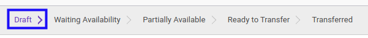

# Konfirmasi Rental Supplier Out

## A. INPUT

* Data rental supplier out yang dapat dikonfirmasi harus memiliki status **Draft**.

* User yang akan mengkonfirmasi harus memiliki akses untuk mengkonfirmasi rental supplier out.

## B. LANGKAH KERJA

1. Buka menu **Warehouse -> Operations -> Nama Gudang -> Rental Supplier Out**. Abaikan jika sudah berada pada menu yang dimaksud.
2. Buka data Rental Supplier Out yang akan dikonfirmasi. Abaikan jika data sudah dibuka.
3. Klik tombol **Mark as Todo** pada bagian atas-kiri form.

## C. OUTPUT

* Status dari rental supplier out akan berubah menjadi **Waiting Availability**.

