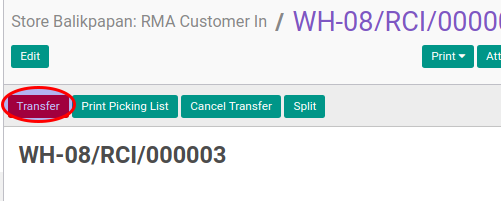

# Merealisasi RMA Customer In

## A. INPUT

* Data RMA customer in yang akan direalisasi harus memiliki status **Ready To Transfer**.
* User yang akan merealisasi harus memiliki akses untuk merealisasi RMA customer in.

## B. LANGKAH KERJA

1. Buka menu **Warehouse -> Operation -> (Nama Gudang) -> RMA Customer In**. Abaikan jika sudah berada
pada menu yang dimaksud.
2. Buka data RMA customer in yang akan direalisasikan. Abaikan jika data sudah dibuka.
3. Klik tombol **Transfer** pada bagian atas-kiri form.

Pop-up **Enter Transfer Detail** akan muncul

4. Isi **Actual Movement Date**.
5. Untuk setiap produk yang terdapat pada tabel **Product To Move** lakukan prosedur [Realisasi Produk](./transfer-product.md).
6. Apabila serial number ingin dibuat secara otomatis klik tombol **Generate Lot**

7. Klik tombol **Apply** pada bagian bawah-kiri form

## C. OUTPUT

* Status dari RMA customer in akan berubah menjadi **Transfered**

