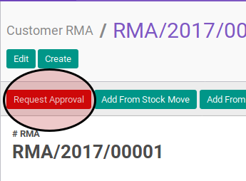
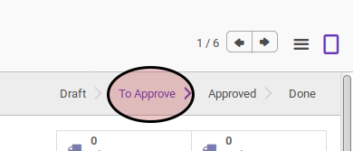

# Konfirmasi RMA Customer

## A. INPUT

* Data customer RMA yang akan dikonfirmasi harus memiliki status **Draft**.

* User yang akan mengkonfirmasi harus memiliki akses untuk mengkonfirmasi customer RMA.

## B. LANGKAH KERJA

1. Buka menu **Warehouse -> Customer RMA -> Customer RMA**. Abaikan apabila sudah berada pada menu yang dimaksud.
2. Buka dara Customer RMA yang akan dikonfirmasi. Abaikan jika data sudah dibuka
3. Klik tombol **Request Approval** pada bagian atas-kiri form.

## C. OUTPUT

* Data Customer RMA akan berubah menjadi **To Approve**.

